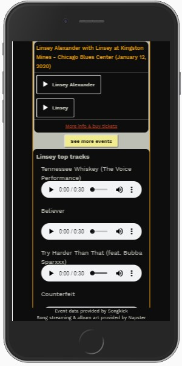

# Meet the Music
Find your next concert - anywhere, anytime.

## Summary
Enter the information for where you're going and when. Get back a list of concert events to attend, and listen in to discover the artist you want to see.

This is an app for travelers looking for their next live music experience. The app searches the Songkick API for upcoming events by date and location, and in the same window allows the user to sample top tracks from each artist (sourced from Napster API) to discover the user's next concert of interest.

## Live App
https://beckibloom.github.io/MeetTheMusic/

## Built with
* HTML/CSS
* Javascript/jQuery

## API sources
* Songkick API (source for event and artist information)
* Napster API (source for album artwork and music sample tracks)

## Screenshots

Landing page:

Location select:

Explore events:

Explore events on mobile:

Music player on mobile:

